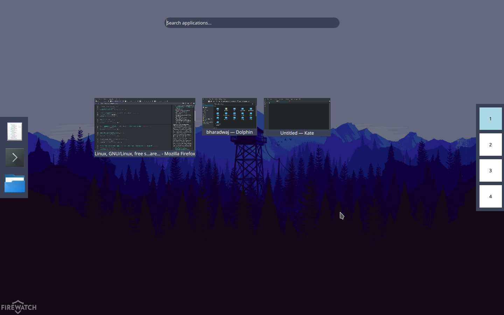
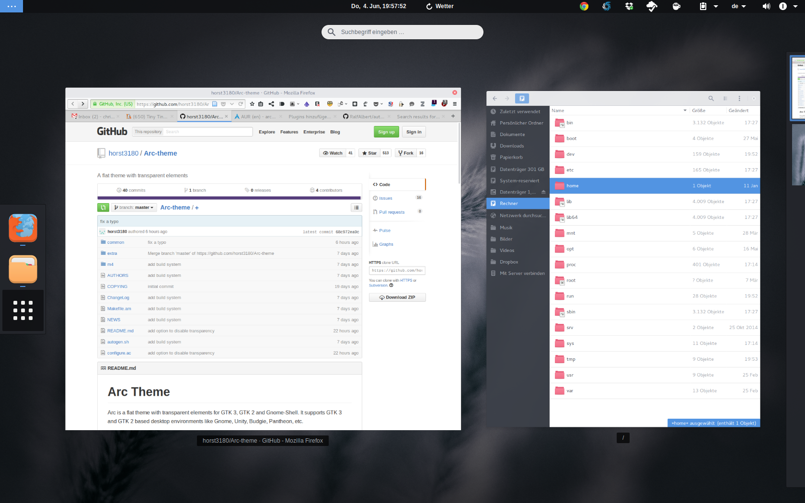

# qOverview
### GNOME's Activities dashboard, for other desktops

qOverview is a dashboard which ~~is a clone of~~ is inspired by GNOME's Activities.

*qOverview*:

*GNOME Activities*:

qOverview is written in QML with a Python backend.

## How to Install

### Prerequisites

The following programs must be installed before installing qOverview. Package names of these for major distros are listed alongside.

- Python 3
- PyQt 5 (Arch: `python-qt5` | Ubuntu: `python3-pyqt5` | SUSE: `python3-qt5` | Fedora: `python3-PyQt5`)
- Python-DBus (Arch: `python-dbus` | Ubuntu: `python3-dbus` | SUSE: `python-dbus` | Fedora: `python3-dbus`)
- Python-GObject (Arch: `python-gobject` | Ubuntu: `python3-gi` | SUSE: `python3-gobject` | Fedora: `pygobject3`)
- PyYAML (Arch: `python-yaml` | Ubuntu: `python3-yaml` | SUSE: `python3-PyYAML` | Fedora: `python3-PyYAML` | PyPI/Pip: `PyYAML`)
- imagemagick (Arch, Ubuntu, SUSE, Fedora: `imagemagick`)
- wmctrl (Arch, Ubuntu, SUSE, Fedora: `wmctrl`)
- xdotool (Arch, Ubuntu, SUSE, Fedora: `xdotool`)

**NOTE**: qOverview needs X11 to run, and thus is incompatible with Wayland.

<small>If the listed package names are incorrect/don't work/etc please [report the issue](https://github.com/bharadwaj-raju/qOverview/issues/new)!</small>

### Installation

Download and run:

    $ sudo ./install.sh

## How to Setup & Use

### Initial Setup

1. Set the `qoverview-config-server` command to run on startup.

2. Run the command `qoverview-config-server >/dev/null 2>&1 & disown` in a terminal.

3. Add items to the dock using the file `~/.config/qoverview.yaml`. See [Settings](#settings).

4. You can now put the `qoverview` command on a shortcut key, and/or a screen corner.

See your desktop's settings tool for these.

For putting qOverview on a screen corner, see [Binding to screen corner](#binding-to-screen-corner).

### Use

Press said shortcut key/screen corner and see!

**NOTE**: In qOverview, middle mouse button click on a window will *close* it. This can be disabled, see [settings](#settings)

## Settings

See the file `~/.config/qoverview.yaml`. It has all the settings (and is quite well-commented).

## Binding to screen corner

The `xdotool` utility will allow you to do bind qOverview to a screen corner or edge easily.

You can bind to the following corners and edges of the screen:

- `top`
- `bottom`
- `left`
- `right`

- `top-left`
- `top-right`
- `bottom-left`
- `top-right`

To do this, run the command

    $ xdotool behave_screen_edge EDGE_OR_CORNER exec qoverview

where `EDGE_OR_CORNER` is to be replaced with the position of your choice from the list above.

Also, set the above-mentioned command to run at startup.

## License

Licensed under the GNU General Public License version 3 or (at your option) a later version.

See the included LICENSE file.

## Credits

KDE's Breeze icon theme for the included missing-icon.svg (taken from question.svg)
